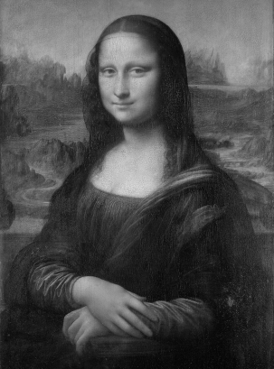
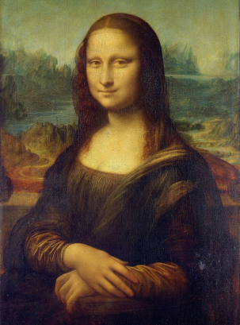

# [MFBdjvu](https://github.com/ImageProcessing-ElectronicPublications/mfbdjvu) demo

MFBdjvu is a simple project for easy converting pgm and ppm to (MASK+FG+BG)-djvu.
It uses [djvulibre](http://djvu.sourceforge.net/) for all technichal work and compression.
The breakdown of the image into components is done using [DjVuL](https://github.com/plzombie/depress/issues/2) and [DjVuL wiki](https://sourceforge.net/p/imthreshold/wiki/DjVuL/?version=3).

MFBdjvu based of [simpledjvu](https://github.com/mihaild/simpledjvu).

## demo



```shell
mfbdjvu mona.pgm mona.pgm.djvu

 12435473 mona.pgm
   753205 mona.pgm.djvu
```



```shell
mfbdjvu mona.ppm mona.ppm.djvu

 37306385 mona.ppm
   777396 mona.ppm.djvu
```
